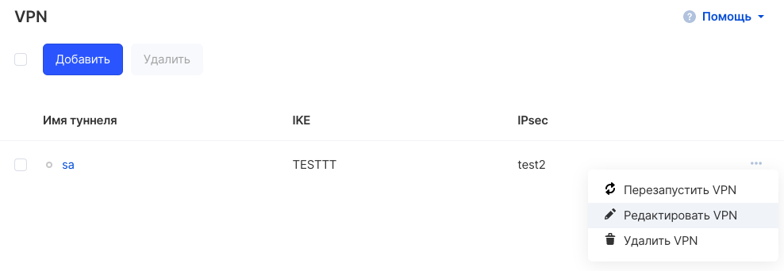
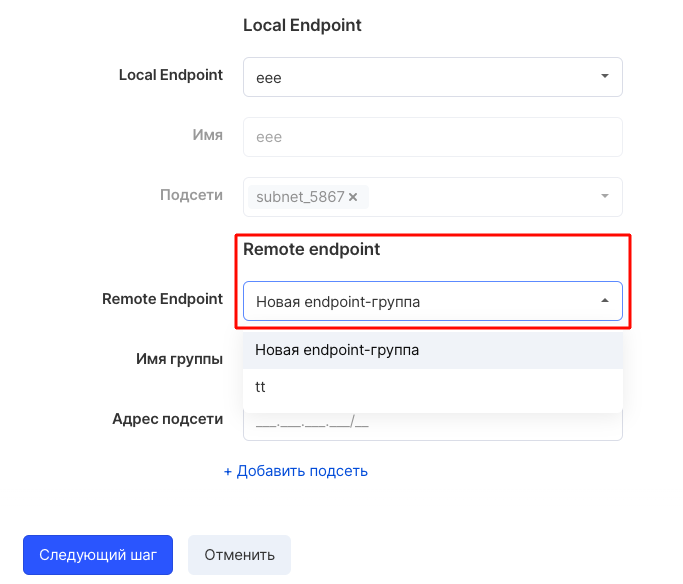
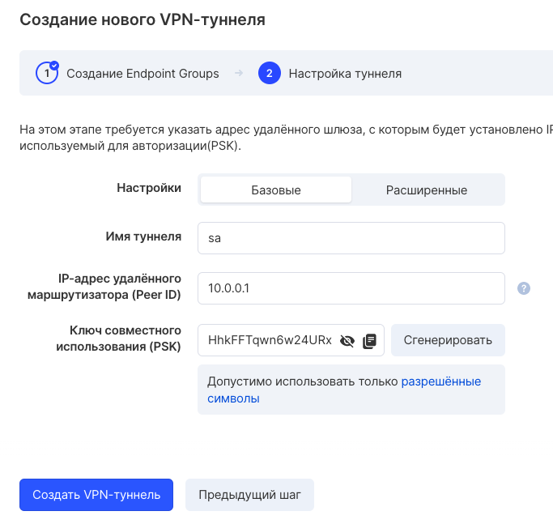

Для добавления подсети в VPN подключение следует использовать опцию "Редактировать VPN" в выпадающем списке опций:

На шаге 1 выбрать "Новая endpoint-группа":

Ввести IP-адрес новой подсети и прейти к следующему шагу кнопкой "Следующий шаг":

Прежде чем завершить изменения, необходимо убедиться в правильности введенных данных и подтвердить их нажатием кнопки "Создать VPN-туннель".