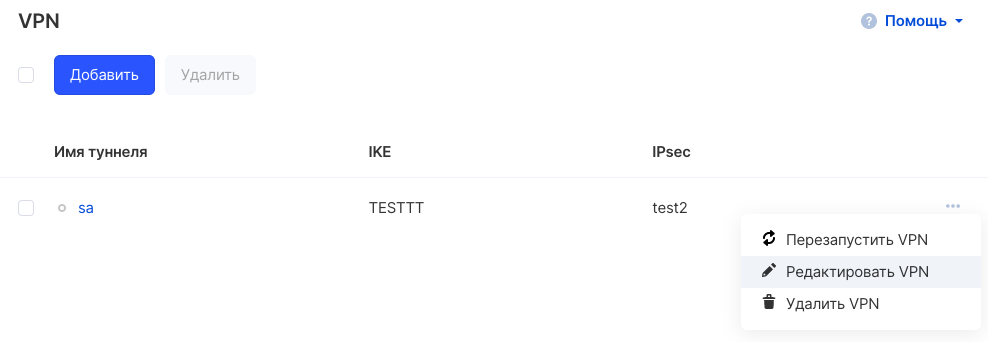
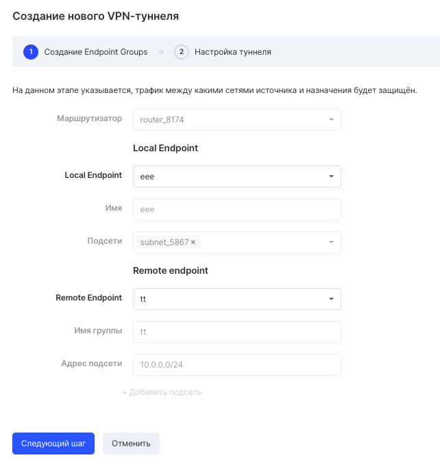
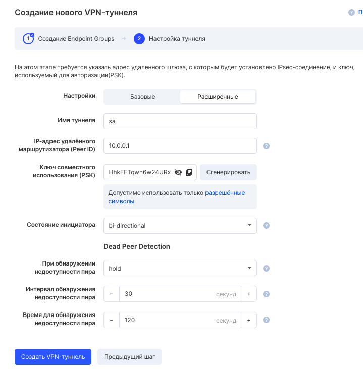

Для редактирования VPN следует выбрать соответствующее меню из выпадающего списка опций:

В открывшемся мастере следует указать новые данные для редактируемых параметров:

### Если возникли проблемы

При возникновении проблем с VPN вы можете управлять сущностями VPN в старом интерфейсе [https://infra.mail.ru/](https://infra.mail.ru/). Вкладка VPN > Сервисы VPN.